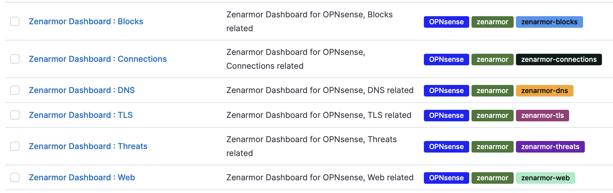

# Zenarmor Kibana Dashboards

Here are dashboards for Kibana from the Elastic Stack, which you can use to visualize the different outputs from the Zenarmor (Sensei) plugin in OPNsense, through an external Elasticsearch database. 

## Prerequisites

OPNsense
- 21.7.3_3-amd64

Sensei 
- Engine Version: 1.9.3 
- UI Version:	21.9.14
- Database Version:	1.9.21091012

Elastic Stack:
- kibana 7.15.0
- elasticsearch 7.15.0

## Installation:
### Configure Elasticsearch
Create a user with Role permissions to create Indicies in Elasticsearch. 

The Zenarmor (Sensei) plugin in OPNsense creates these indicies in elasticsearch:
- alert
- conn
- dns
- http
- sip
- tls

### Configure Zenarmor (Sensei)
Configure Zenarmor (Sensei) in OPNsense to use an external database (elasticsearch). If you have Zenarmor (Sensei) already installed, uninstall and install again to be able to select an external database.

### Configure Kibana

Create Index patterns in Kibana (Stack Management > Kibana > Index Patterns > "Create index pattern"):
- alert-*
- conn-*
- dns-*
- http-*
- sip-*
- tls-*

Import the dashboards through Kibana (Stack Management > Kibana > Saved Objects > "Import")

- dashboards/zenarmor-dashboard-blocks-7.15.0.ndjson
- dashboards/zenarmor-dashboard-connections-7.15.0.ndjson
- dashboards/zenarmor-dashboard-dns-7.15.0.ndjson
- dashboards/zenarmor-dashboard-tls-7.15.0.ndjson
- dashboards/zenarmor-dashboard-web-7.15.0.ndjson

### Changelog

Trying to just smooth things over as I work with this.

## How to use it:

Analytics > Dashboard 

## Documentation

For documentation and a more thorough installation guide (manual installation on Ubuntu), see (coming soon)

## Contributing

There are many ways to contribute:
- Fix and [report bugs]
- Improve documentation